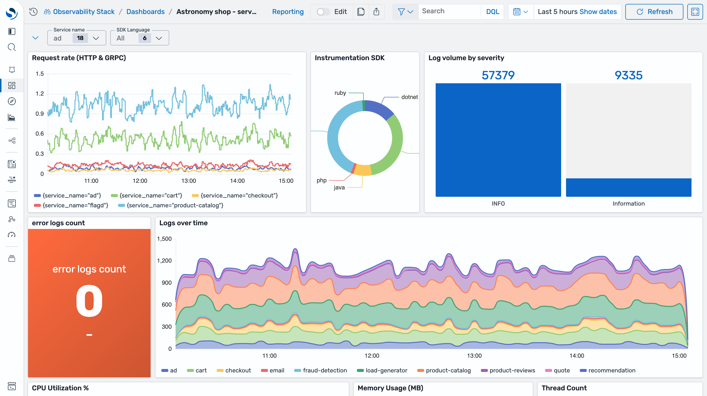
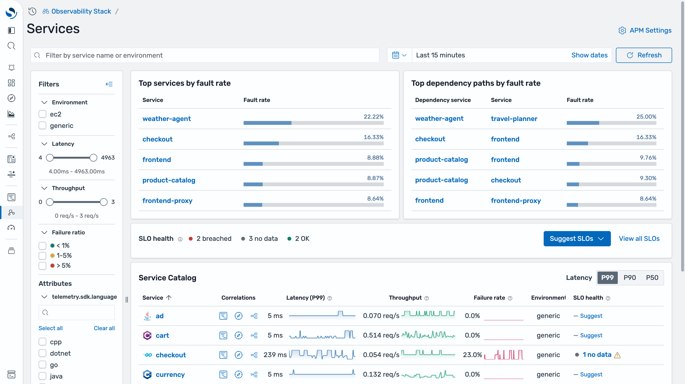
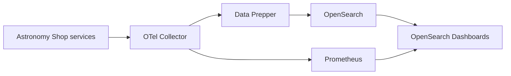

The [OpenTelemetry Demo](https://opentelemetry.io/docs/demo/) is a microservices e-commerce app (the Astronomy Shop) that emits logs, traces, and metrics across services written in Go, Python, Java, .NET, Node.js, Ruby, PHP, and C++. Enable it in Observability Stack to explore the stack with realistic telemetry before you instrument your own services.

The demo ships as an opt-in Docker Compose include file. The stack runs the OTel Collector, Data Prepper, OpenSearch, Prometheus, and OpenSearch Dashboards; enabling the demo adds the Astronomy Shop services and points their telemetry at that pipeline.

## Install and enable the demo

Enabling the demo depends on how you install Observability Stack:

- **Docker Compose:** follow the [installation guide](/docs/get-started/installation/#opentelemetry-demo) and uncomment `INCLUDE_COMPOSE_OTEL_DEMO` in `.env`.
- **Kubernetes (Helm):** set `opentelemetry-demo.enabled=true` (for example, `--set opentelemetry-demo.enabled=true`). See [Kubernetes (Helm)](/docs/deploy/kubernetes/).

For Docker Compose, the demo image version is pinned by `DEMO_VERSION` in `.env`. Change that value to run a different release.

## Generate and view telemetry

The demo's load generator drives traffic automatically, so telemetry starts flowing without any manual steps. To browse the app yourself, open the web store at [http://localhost:8080/](http://localhost:8080/). Then open OpenSearch Dashboards to explore the data.

### Service telemetry dashboard

The **Astronomy shop - service telemetry** dashboard is created for you automatically. Open it from **Dashboards**. It correlates logs and metrics across the demo services: request rate by service, instrumentation SDK breakdown, log volume by severity, log throughput over time, and per-service CPU, memory, and thread counts. Filter by service name or SDK language using the controls at the top.

### Application performance (APM)

Open **Services** under Application performance to see the trace-derived service catalog: P50/P90/P99 latency, throughput, and failure rate per service, top services and dependency paths by fault rate, and SLO health. From any row, jump to that service's spans, logs, or service map.
See [Application Performance Monitoring](/docs/apm/) for service maps, SLOs, and the rest of the APM workflow.

## Access points

| URL | What it is |
|-----|------------|
| [http://localhost:8080/](http://localhost:8080/) | Web store (frontend) |
| [http://localhost:8080/loadgen/](http://localhost:8080/loadgen/) | Load generator UI |
| [http://localhost:8080/feature](http://localhost:8080/feature) | Feature flag UI |
| [http://localhost:5601](http://localhost:5601) | OpenSearch Dashboards |

Use the feature flag UI to toggle the demo's built-in failure scenarios (for example, a payment or cart fault) and watch the error rate change in the dashboards and APM views.

## How the data flows

Services export OTLP to the Collector. The Collector sends logs and traces to Data Prepper, which indexes them into OpenSearch, and sends metrics to Prometheus. OpenSearch Dashboards reads from both.

## Troubleshooting

- **Services restart or exit on startup.** Usually the container runtime is short on memory. Raise its limit to at least 8 GB.
- **Dashboards are empty.** Give the load generator a minute to produce data, then widen the dashboard time range. Confirm the demo services are up with `docker compose ps`.

## Next steps

- [Ingest Your First Traces](/docs/get-started/quickstart/first-traces/) — instrument your own application
- [Create Your First Dashboard](/docs/get-started/quickstart/first-dashboard/) — build custom visualizations
- [Send Data](/docs/send-data/) — more instrumentation and ingestion options
